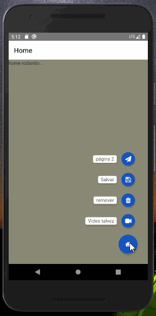

<h1 align="center">
    Teste simples com floating-action em React Native
</h1>

<p align="center">


  

 </P>

## 💻 Sobre o projeto

Projeto desenvolvido para teste de [react-native-floating-action]



## 🛠 Tecnologias

As seguintes ferramentas foram usadas na construção do projeto:

- [reactNative]
- [react-native-floating-action]
- [vscode]

## Como executar o projeto

### Pré-requisitos

- Ambiente configurado para React Native

### Executando o projeto

```bash
# Clone este repositório
$ git clone https://github.com/euRamiro/rn_floating_menu/

# Acesse a pasta do projeto no terminal/cmd
$ cd rn_floating_menu

# Instale as dependências
$ npm install

# Execute
$ npx react-native run-android

```

## 📝 Licença

Este projeto está sobe a licença MIT.

[Contato!](https://www.linkedin.com/in/ramiro-da-silva-amorim/)

[reactnative]: https://reactnative.dev/
[react-native-floating-action]: https://github.com/santomegonzalo/react-native-floating-action#readme
[vscode]: https://code.visualstudio.com/
[license]: https://opensource.org/licenses/MIT
